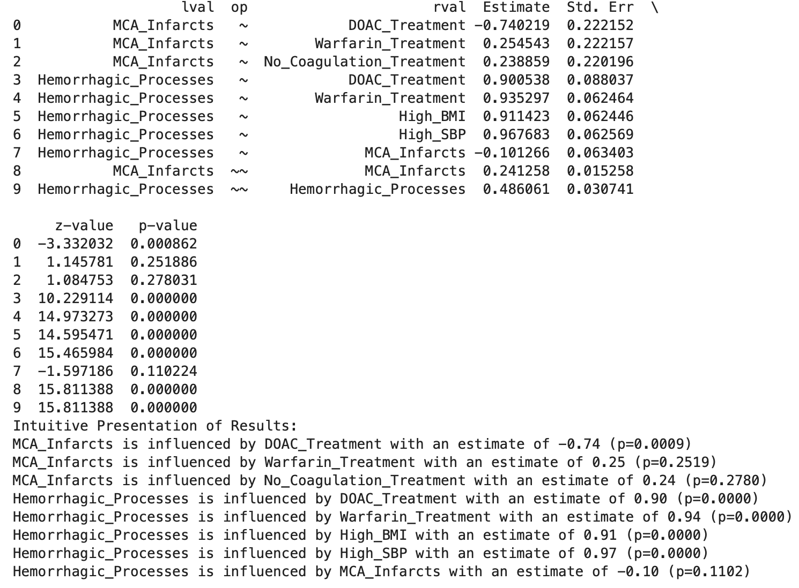
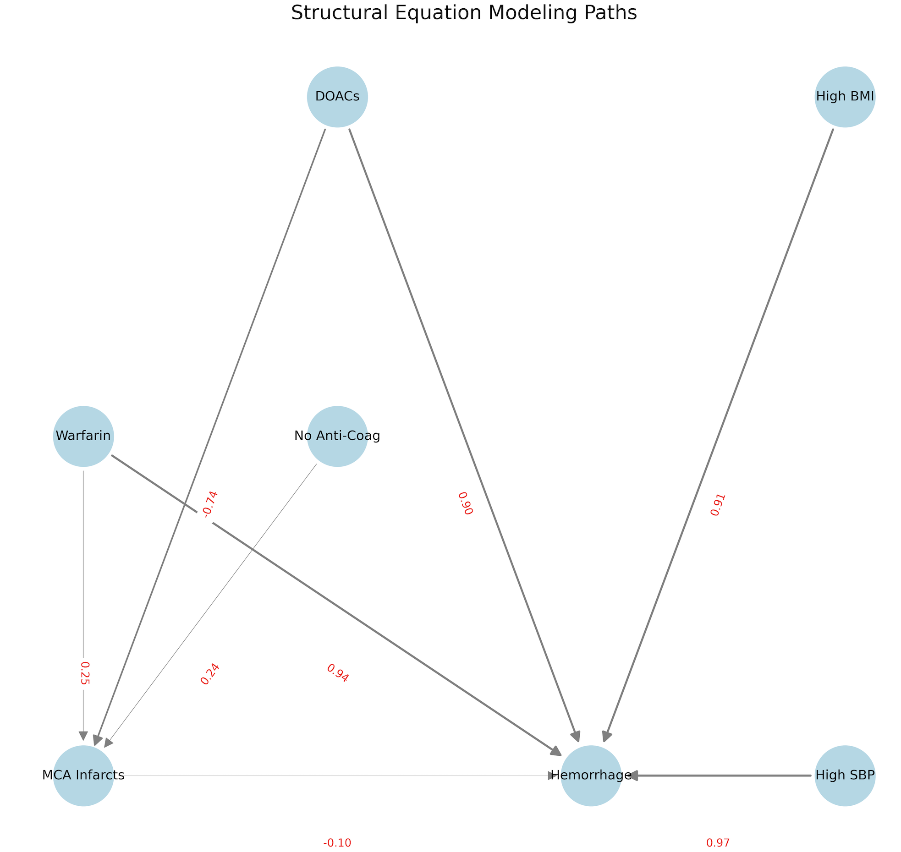

# Effects of Direct Oral Anti-Coagulants (DOACs) and Warfarin on Middle Cerebral Artery (MCA) Infarcts
In this simulated dataset, I made an attempt to evaluate the effects DOACs and Warfarin therapy on the prevalence of MCA strokes (ishchemic). In the simulated data I have data for 500 patients, including their body mass index (BMI), sytolic blood pressure (SBP), the prevalence of MCA strokes and hemorrhage in penetrating arteries in the basal ganglia nd thalamic regions. In this code I use the Structural Equation Modeling (SEM) which is a multivariate statistical method that uses a range of techniques used to analyse the structural relationships between observed variables. Essentially, it combines factor analysis and multiple regression analysis. SEM allows you to test hypotheses about the patterns of relationships and interactions among variables. *Scroll to the bottom of this readme file for result interpretation.

Outputs:

printed results :

Network graph:

Key elements of SEM:
1. Latent variables: These are variables that are not directly observed but are inferred or estimated from other variables. 
2. Observed variables: These are variables that are directly measured or observed.
3. Structural model: Specifies relationships between latent variables.
4. Measurement model: Relates observed variables to latent variables.
5. Paths: Specified links between variables. 

### Code Explanation:

# Simulating Data: 
    - You initialise a seed for reproducibility (np.random.seed(42)).
    - Simulate data for different treatments, BMI, and SBP. 
    - The simulation determines the occurrence of MCA infarcts and hemorrhagic processes based on various conditions and treatments.
# Specifying the Model: 
    - The model you've specified has two main parts: the equation for MCA_Infarcts and the equation for Hemorrhagic_Processes.
    - You're trying to determine how different treatments (and other factors) predict MCA_Infarcts and Hemorrhagic_Processes.
# Fitting the Model:
    - The SEM model is fitted using the provided data. 
    - The inspect() method then provides estimates, standard errors, and p-values for the coefficients of the relationships specified in the model.

# Visualizing the Model:
    - Using the `networkx` library, you've visualized the relationships among variables, represented by directed edges between nodes.
    - The strength and direction (positive/negative) of the relationships are indicated by edge labels.

### Interpretation of the results:

MCA Infarcts:
    - DOAC treatment decreases the chance of MCA infarcts (Estimate = -0.74, p < 0.05). This is statistically significant.
    - Warfarin treatment (Estimate = 0.25, p = 0.2519) and No Coagulation treatment (Estimate = 0.24, p = 0.2780) do not show a statistically significant impact on MCA infarcts.

Hemorrhagic Processes:
    - DOAC treatment, Warfarin treatment, High BMI, and High SBP all increase the chances of Hemorrhagic Processes, and they're all statistically significant (p < 0.05).
    - MCA Infarcts have a small and not statistically significant decrease on Hemorrhagic Processes (Estimate = -0.10, p = 0.1102).

### Overall:

- DOAC treatment might be effective in reducing MCA infarcts.
- However, both DOAC and Warfarin treatments seem to increase the chances of hemorrhagic processes, especially if combined with high BMI or high SBP.
- Warfarin's impact on MCA infarcts isn't statistically significant, but its impact on hemorrhagic processes is strong and significant.
- High BMI and high SBP individually increase the chances of Hemorrhagic Processes.
#### * Note that this is a simulated practice and the results do not necassarily reflect realworld scenarios.
